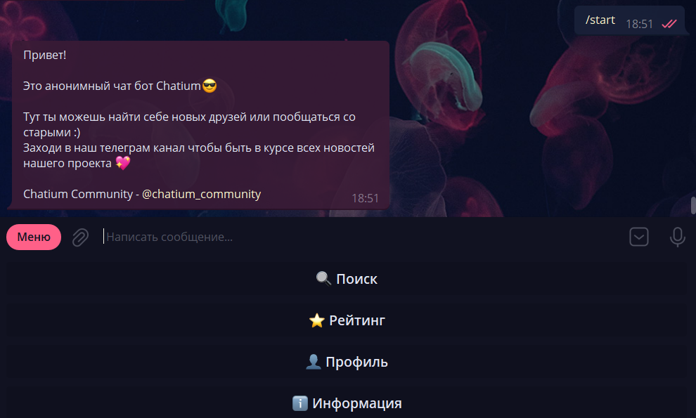

# Анонимный чат для телеграма

Анонимный телеграм чат бот Chatium для анонимного общения

Из реализованного функционала :
  - поиск собеседника
  - стоп, следующий, монетка и поделиться ссылкой(комманды)
  - комманды типа /search
  - рейтинг
  - профиль
  - отправка баг репортов

# Requirements

  - **aiogram**
  - **sqlalchemy**
  - **loguru**
  
# Структура проекта:

  - **main.py** - файл для сборки и запуска проекта(**View**)
  - **config.py** - файл для конфигурационных настроек
  - **database_worker.py** - файл для моделей базы данных(**Model**)
  - **loger.py** - файл кастомного логера
  - **utils.py** - файл для утилити функций
  - **string_const.py** - файл для текста оформления
  - **user_worker.py** - файл инкапсулирующий в себе функционал для работы с пользователем(**Controller**)
